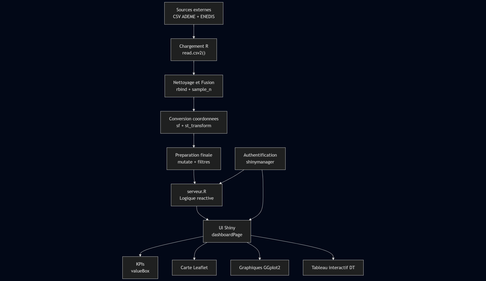

# Documentation Technique : Analyse DPE Lyon vs Lille

Ce document détaille l'architecture technique, les dépendances et la procédure d'installation de l'application Shiny d'analyse des DPE.

## 1. Schéma de l'architecture

Le schéma ci-dessous présente l’architecture globale de l’application. Il illustre le cheminement complet des données, depuis leur récupération dans les sources externes jusqu’à leur exploitation dans l’interface Shiny. 
On y voit les différentes étapes de transformation (chargement, nettoyage, fusion, conversion), ainsi que la structure logique de l’application elle-même (serveur, interface utilisateur, modules d’affichage). 
L’objectif est de fournir une vision d’ensemble du fonctionnement interne afin de mieux comprendre comment les données alimentent les tableaux de bord, graphiques et cartes interactives.



## 2. Packages Nécessaires

L'application repose sur les 9 packages R suivants :

* **shiny** : Framework principal de l'application.
* **shinydashboard** : Structure le tableau de bord (header, sidebar, body).
* **dplyr** : Utilise pour toutes les manipulations de données (`filtres`, `group_by`, `summarise`).
* **ggplot2** : Moteur de génération pour tous les graphiques (`histogrammes`, `barres`, `nuages de points`...).
* **scales** : Permet de formater les axes et les étiquettes (ex: `percent()`).
* **leaflet** : Génère la carte interactive (`points`, `légendes`, `popups`).
* **DT** : Affiche les tables de données interactives (onglet "Contexte").
* **sf** : Requis pour la conversion des coordonnées géographiques (Lambert-93 vers WGS84).
* **shinythemes** : Permet le changement de thème par l'utilisateur.
* **rsconnect** : Requis pour le déploiement de l'application sur shinyapps.io

Absolument. Vous avez raison, maintenant que le projet est sur GitHub, la section 3.3 est obsolète.

Voici la section 3 mise à jour. J'ai entièrement réécrit la partie "Lancement de l'application" pour qu'elle corresponde à un clonage ou un téléchargement depuis GitHub.

-----

## 3\. Guide d'installation

Voici les étapes pour installer et lancer l'application sur un poste local.

### 3.1. Prérequis

  * **R** (version 4.0 ou supérieure).
  * **RStudio** (recommandé).

### 3.2. Installation des packages

1.  Ouvrez RStudio et copiez-collez la commande suivante dans la console pour installer tous les packages requis :

    ```r
    install.packages(c("shiny", "shinydashboard", "dplyr", "ggplot2", 
                       "scales", "leaflet", "DT", "sf", 
                       "shinythemes"))
    ```

### 3.3. Lancement de l'application

L'intégralité du code, y compris le script `app.R` et le dossier `www/`, se trouve dans le dossier `app/` de ce dépôt GitHub.

**Téléchargement (ZIP)**

1.  Sur la page principale du dépôt GitHub, cliquez sur le bouton vert **`< > Code`**.
2.  Sélectionnez **"Download ZIP"**.
3.  Décompressez le fichier `.zip` sur votre ordinateur.
4.  Ouvrez RStudio.
5.  Dans RStudio, naviguez (`File > Open File...`) et ouvrez le fichier `app.R` situé dans le dossier `[nom-du-dossier-dezippé]/app/app.R`.
6.  Cliquez sur le bouton **"Run App"** en haut à droite de l'éditeur de script.

L'application se lancera et vous présentera l'écran de connexion.

### 3.4. Identifiants de connexion

  * **Utilisateur :** `admin`
  * **Mot de passe :** `admin`